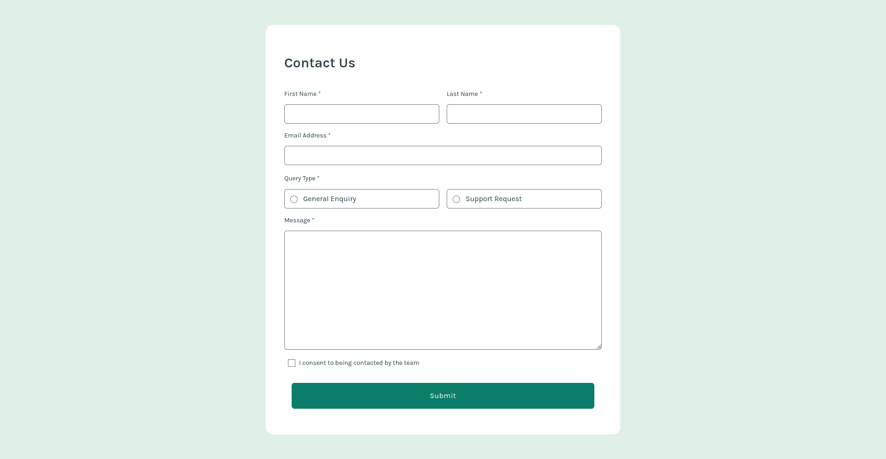

# Frontend Mentor - Contact form solution

This is a solution to the [Contact form challenge on Frontend Mentor](https://www.frontendmentor.io/challenges/contact-form--G-hYlqKJj). Frontend Mentor challenges help you improve your coding skills by building realistic projects. 

## Table of contents

- [Overview](#overview)
  - [The challenge](#the-challenge)
  - [Screenshot](#screenshot)
  - [Links](#links)
- [My process](#my-process)
  - [Built with](#built-with)
  - [What I learned](#what-i-learned)


- [Author](#author)


## Overview

### The challenge

Users should be able to:

- Complete the form and see a success toast message upon successful submission
- Receive form validation messages if:
  - A required field has been missed
  - The email address is not formatted correctly
- Complete the form only using their keyboard
- Have inputs, error messages, and the success message announced on their screen reader
- View the optimal layout for the interface depending on their device's screen size
- See hover and focus states for all interactive elements on the page

### Screenshot




### Links

- Solution URL: [Add solution URL here](https://your-solution-url.com)
- Live Site URL: [Add live site URL here](https://your-live-site-url.com)

## My process

### Built with

- Semantic HTML5 markup
- [TailwindCSS](https://tailwindcss.com) with custom properties
- Flexbox
- Mobile-first workflow
- [React](https://reactjs.org/) - JS library
- [Vite](https://vitejs.dev) - Build tool

# Project Title

## What I Learned

During this project, I gained valuable insights and skills. Here are the key takeaways:

#### 1.Error Handling and Email Verification

One of the essential aspects of form handling is validating user input. I learned how to implement basic error handling and email verification using JavaScript. This ensures that the email field is not empty and contains a valid email address format.

```js
if (!formData.email.trim()) {
  validationErrors.email = "This field is required";
} else if (!/\S+@\S+\.\S+/.test(formData.email)) {
  validationErrors.email = "Please enter a valid email address";
}
```
#### 2.Using Tailwind CSS Alongside Custom CSS
I discovered how to effectively combine Tailwind CSS with custom CSS styles. This approach allows for a flexible and visually consistent design system.

#### 3.Implementing In-Site Alerts Instead of JavaScript Alerts
To enhance the user experience, I learned how to create in-site alerts using React state management and Tailwind CSS, moving away from the typical JavaScript alert method. This method provides a more polished and integrated way to display messages to users.

```js
const [showMessage, setShowMessage] = useState(false);

useEffect(() => {
  if (showMessage) {
    const timer = setTimeout(() => {
      setShowMessage(false);
    }, 5000);
    return () => clearTimeout(timer);
  }
}, [showMessage]);

```
**In the JSX, I conditionally render the alert based on the showMessage state**

```jsx
{showMessage && (
  <div 
    className="fixed flex items-center p-4 text-sm text-gray-100 transform -translate-x-1/2 bg-gray-800 rounded-lg top-2 left-1/2" 
    role="alert">
    <CheckCircleOutline />
    <div>
      <h6 className="mx-3 text-xl font-semibold">Message Sent!</h6>
      <p className="mx-3 text-gray-400">Thanks for completing the form. We'll be in touch soon!</p>
    </div>
  </div>
)}

```


## Author

- Website - [Nadun](https://nadun.tech)
- Frontend Mentor - [@nadunkms](https://www.frontendmentor.io/profile/nadunkms)
- Github - [@nadunkms](https://www.github.com/nadunkms)


### Thank you!
